  

# Awesome First-Person Shooter Video Game 🎮 🔫

  
  
  
  
  

---

## 💡 Overview & Market Landscape 📊

Welcome to the ultimate curated list of **commercial first-person shooter (FPS) video games** and **open-source FPS engine projects**. Whether you are looking for fast-paced arena combat, tactical squad gameplay, hero-based battle royales, or production-ready open-source game engines to build your own game, this repository covers the best-in-class solutions. 🎯

### 📈 Sector Market Size & Concentration

> 📊 **Estimated Market Size & Industry Dynamics:**  
> The global first-person shooter (FPS) market is estimated at **~$25 Billion in 2026** and projected to expand toward **~$45 Billion by 2032**. The sector is **moderately concentrated** — dominant franchises like *Call of Duty* (Activision) and *Apex Legends* (EA) lead the AAA premium and battle-royale segments, while titles like *Halo*, *Destiny*, *Overwatch*, and *Rainbow Six* hold massive dedicated communities. Due to distinct sub-genres (Hero Shooters, Arena FPS, Tactical Simulators, Looter-Shooters), no single platform holds a total winner-take-all monopoly, leaving substantial opportunity for both major publishers and open-source game communities.

---

## 📖 Table of Contents

- [💼 Commercial & SaaS FPS Games](#-commercial--saas-fps-games)
- [🔓 Open-Source GitHub Projects](#-open-source-github-projects)
- [🤝 How to Contribute](#-how-to-contribute)
- [💖 Support & Sponsorship](#-support--sponsorship)
- [⚠️ Disclaimer](#%EF%B8%8F-disclaimer)
- [⭐ Star History](#-star-history)

---

## 💼 Commercial & SaaS FPS Games

Below is a breakdown of major commercial FPS titles, organized by company revenue / valuation scale (descending order).

| Product / Game 🎮 | Description 📝 | Company Size 🏢 (Revenue/Valuation) | Pricing (Starting Tier) 💰 | Free Tier / Trial Limits ⏳ |
| :--- | :--- | :--- | :--- | :--- |
| **Halo Infinite** | Microsoft's flagship FPS featuring Master Chief in an open-world campaign and competitive arena multiplayer. 🛡️ | ~$281.8B revenue (Microsoft FY2025) | Campaign: $59.99 standard purchase | Free-to-Play multiplayer mode with optional $10 seasonal battle passes. ♾️ |
| **Call of Duty: Modern Warfare III** | The flagship annual tactical shooter featuring cinematic campaign, multiplayer, and Zombies modes. 💥 | ~$8.7B revenue (Activision Blizzard FY2025 est.) | $69.99 standard edition | No free tier for full game; Warzone battle royale mode is free-to-play. 🪂 |
| **Overwatch 2** | Team-based 5v5 hero shooter with tactical synergy, distinct character roles, and competitive ranked play. 🦸‍♂️ | ~$8.7B revenue (Activision Blizzard FY2025 est.) | Free-to-Play base game | Free access to all heroes; optional $10 seasonal battle passes and cosmetics. 🎟️ |
| **Apex Legends** | High-velocity squad-based hero battle royale featuring unique Legend mobility and combat abilities. 🏆 | ~$7.5B revenue (EA FY2025 est.) | Free-to-Play base game | Free full battle royale mode; optional $10 seasonal battle passes and items. 🛡️ |
| **Battlefield 2042** | Large-scale 128-player tactical warfare featuring dynamic weather events, destructible environments, and vehicles. ⚔️ | ~$7.5B revenue (EA FY2025 est.) | $59.99 standard edition | Periodic free play weekends (3–4 days); select community Portal modes free. 🚁 |
| **Titanfall 2** | Acclaimed pilot-and-mech FPS with high-speed wall-running, fluid parkour, and a legendary single-player campaign. 🤖 | ~$7.5B revenue (EA FY2025 est.) | $29.99 standard edition | No permanent free tier; paid purchase required for full campaign & multiplayer. ⚙️ |
| **Destiny 2** | Sci-fi looter-shooter MMO combining shared-world PvE raids, strikes, and competitive PvP Crucible matches. 🌌 | ~$4.0B valuation / revenue (Bungie / Sony Interactive) | Free-to-Play base edition | Free base campaign, strikes, and PvP; paid expansions ($19.99–$49.99). 🚀 |
| **DOOM Eternal** | High-octane demon-slaying arena FPS featuring glory kills, heavy metal soundtrack, and aggressive resource management. 🪓 | ~$3.0B valuation / revenue (Bethesda / ZeniMax Media) | $39.99 standard edition | No free tier; full game purchase required. 🩸 |
| **Far Cry 6** | Open-world action FPS set in a tropical dictatorship featuring guerrilla warfare, craftable weaponry, and co-op. 🌴 | ~$2.4B revenue (Ubisoft FY2025 est.) | $59.99 standard edition | 2-hour free trial demo available on Ubisoft Connect and consoles. ⏱️ |
| **Tom Clancy's Rainbow Six Siege** | Tactical 5v5 close-quarters operator shooter with fully destructible walls, floors, and environmental surveillance. 🧱 | ~$2.4B revenue (Ubisoft FY2025 est.) | $19.99 base edition | Periodic free play weekends (4 days duration); paid operator unlocks. 💣 |

---

## 🔓 Open-Source GitHub Projects

Explore production-grade open-source FPS games and game engine projects. Ranked by **GitHub Stars_Count (descending)**.

| Stars_Badge 🌟 | Repository / Engine 🚀 | Description & Features 📜 | License 📄 |
| :---: | :--- | :--- | :---: |
|  | **[id-Software/DOOM](https://github.com/id-Software/DOOM)** | The original 1993 classic DOOM source code release that defined the FPS genre. 👾 | GPL-2.0 |
|  | **[id-Software/Quake-III-Arena](https://github.com/id-Software/Quake-III-Arena)** | Legendary Quake III Arena source code by John Carmack, the foundation for modern 3D multiplayer engines. ⚡ | GPL-2.0 |
|  | **[id-Software/Quake](https://github.com/id-Software/Quake)** | The revolutionary 1996 true 3D FPS engine source code. 🌋 | GPL-2.0 |
|  | **[id-Software/DOOM-3-BFG](https://github.com/id-Software/DOOM-3-BFG)** | DOOM 3 BFG Edition engine featuring stencil shadow volumes and advanced C++ renderer. 🔦 | GPL-3.0 |
|  | **[ZDoom/gzdoom](https://github.com/ZDoom/gzdoom)** | Enhanced Doom source port with Vulkan/OpenGL graphics, modern resolutions, 3D floor capabilities, and ZScript. 🎯 | GPL-3.0 |
|  | **[ioquake/ioq3](https://github.com/ioquake/ioq3)** | Clean, updated Quake III Arena engine used by dozens of standalone open-source FPS games. 🕹️ | GPL-2.0 |
|  | **[JACoders/OpenJK](https://github.com/JACoders/OpenJK)** | Community effort to maintain Jedi Academy & Jedi Outcast engines with modern platform support. ⚔️ | GPL-2.0 |
|  | **[dhewm/dhewm3](https://github.com/dhewm/dhewm3)** | Modernized 64-bit cross-platform port of the Doom 3 engine with SDL2 and OpenAL soft audio. 💀 | GPL-3.0 |
|  | **[freedoom/freedoom](https://github.com/freedoom/freedoom)** | Completely free, open-source game assets and IWADs compatible with Doom source ports. 📦 | BSD-3-Clause |
|  | **[Unvanquished/Unvanquished](https://github.com/Unvanquished/Unvanquished)** | Fast-paced FPS combining real-time strategy (RTS) elements: alien technology vs human combatants. 👽 | GPL-3.0 |
|  | **[assaultcube/AC](https://github.com/assaultcube/AC)** | Ultra-lightweight tactical FPS inspired by Counter-Strike. Fast loading, runs on low-end hardware. 🔫 | Zlib |
|  | **[yquake2/yquake2](https://github.com/yquake2/yquake2)** | Official Yamagi Quake II source port, enhancing stability and cross-platform compatibility. 🛠️ | GPL-2.0 |
|  | **[redeclipse/base](https://github.com/redeclipse/base)** | Parkour-oriented arena FPS with wall-running, sliding, impulses, and in-game map editing. 🏃 | Zlib |
|  | **[xonotic/xonotic](https://github.com/xonotic/xonotic)** | Flagship open-source arena FPS with 20+ weapons, high-speed movement physics, and competitive modes. 🏆 | GPL-3.0 |
|  | **[coelckers/prboom-plus](https://github.com/coelckers/prboom-plus)** | Historically accurate, ultra-fast Doom source port for speedrunning and demo recording. ⏱️ | GPL-2.0 |

---

## 🤝 How to Contribute

Contributions are always welcome! Help keep this FPS resource list complete and up to date:

1. **Fork** this repository. 🍴
2. **Add/Edit** entries in `README.md` following the tabular layout. 📝
3. Ensure entries include accurate pricing details, free tier limits, company sizes, or GitHub star links. 🔍
4. **Submit a Pull Request** with a clear explanation of your changes. 🚀
5. Check out [Awesome-Awesome-Awesome](https://github.com/ishandutta2007/Awesome-Awesome-Awesome) for more curated lists! ⭐

---

## 💖 Support & Sponsorship

If you find this repository helpful for finding games, researching game engines, or building your own FPS project:

- ⭐ **Star** this repository to increase its visibility!
- 🔀 **Fork** it to keep a copy in your account.
- 📣 **Share** it with fellow gamers, modders, and game developers!
- ☕ **Buy me a coffee / Sponsor**: If you'd like to support ongoing open-source maintenance, check out the [GitHub Sponsor Dashboard](https://github.com/sponsors/ishandutta2007)! Thank you for your support! ❤️

---

## ⚠️ Disclaimer

This repository is a community-curated list intended solely for educational, historical, and entertainment purposes. 

- Product trademarks, titles, logos, and game assets belong to their respective owners (Microsoft, EA, Activision Blizzard, Ubisoft, Bethesda, Sony, id Software, etc.).
- Commercial FPS titles may feature microtransactions, loot boxes, or in-game purchases. Please check age ratings (ESRB/PEGI) before purchasing. 🔞

---

## ⭐ Star History

